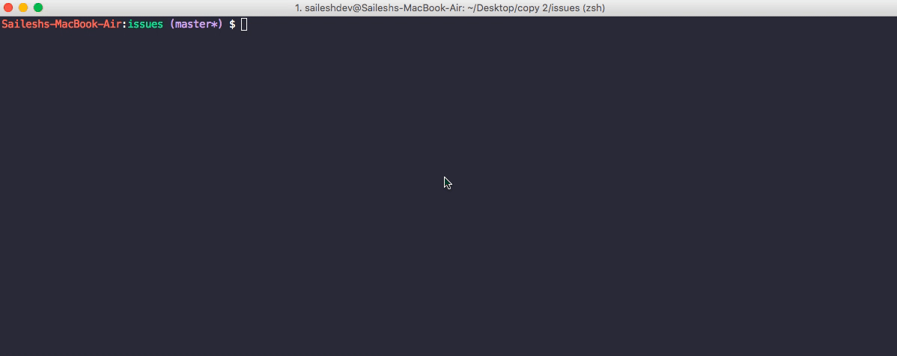

# Github Issues CLI

**Here is a command line executable to fetch issues from any github repo. Check it out! **

## Getting started

In particular, as a first debugging check I suggest getting the test suite to pass on your local machine.
Run mix test and ensure that the tests pass.

1. git clone https://github.com/saileshdev/github-issues-cli.git
2. cd github-issues-cli
3. Run mix escript.build

##Contributing

Contribution is most welcome, that's the whole idea! Together as a community we can build cool products that can solve real life problems and make our lives easier.

Please take a moment to review the [guidelines for contributing](CONTRIBUTING.md).

* [Bug reports](CONTRIBUTING.md#bugs)
* [Feature requests](CONTRIBUTING.md#features)
* [Pull requests](CONTRIBUTING.md#pull-requests)

